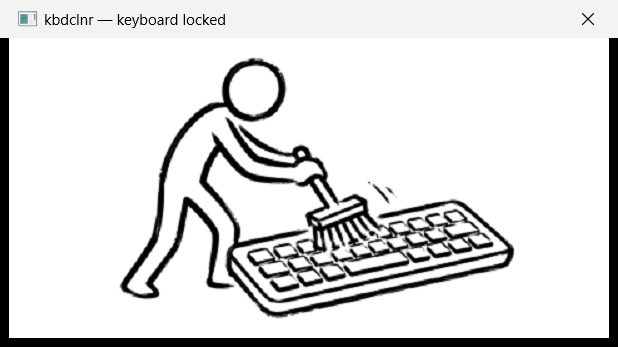

<div align="center">

# 🧹 kbdclnr

**Keyboard lock for cleaning. One function — nothing else.**




</div>

## Why

You want to wipe your keyboard without turning the computer off — but every
swipe over the keys types garbage into the active window. **kbdclnr** solves
exactly that:

1. **Run `kbdclnr.exe`** → all keys are disabled, the mouse keeps working.
2. Clean the keyboard as long as you like — the window stays on top
   as a reminder that the lock is active.
3. **Close the window** with the mouse → the keyboard works again.

## Download

A ready-to-run exe is on the [Releases](../../releases/latest) page.
No dependencies, no installation.

## How it works

The app installs a low-level [`WH_KEYBOARD_LL`](https://learn.microsoft.com/windows/win32/winmsg/lowlevelkeyboardproc)
hook and swallows every keyboard event (returns `1` from the hook). On exit
the hook is removed. If the process dies unexpectedly, Windows removes the
hook automatically — the keyboard can never stay locked.

## Limitations

- **`Ctrl+Alt+Del` is not blocked** — Windows handles the Secure Attention
  Sequence before any hooks. It doesn't get in the way of cleaning.
- The on-screen keyboard and other software input sources are blocked too
  (the hook swallows injected events as well).

## The window image

The window shows a single image and nothing else. It lives in
`assets/window.png` and is compiled into the exe as an `RCDATA` resource, so
the exe stays self-contained. To change it, replace that file and rebuild.

The image is stretched to the client area, which is 480×240 logical pixels
(more on a high-DPI display). For a crisp result on a 150% display, supply the
image at 720×360 or larger.

## Building

All you need is clang (or any C compiler with the Windows SDK):

```sh
llvm-rc kbdclnr.rc
clang -O2 kbdclnr.c kbdclnr.res -o kbdclnr.exe \
    -luser32 -lgdi32 -lole32 -lshlwapi -lwindowscodecs "-Wl,/SUBSYSTEM:WINDOWS"
```

## License

MIT
